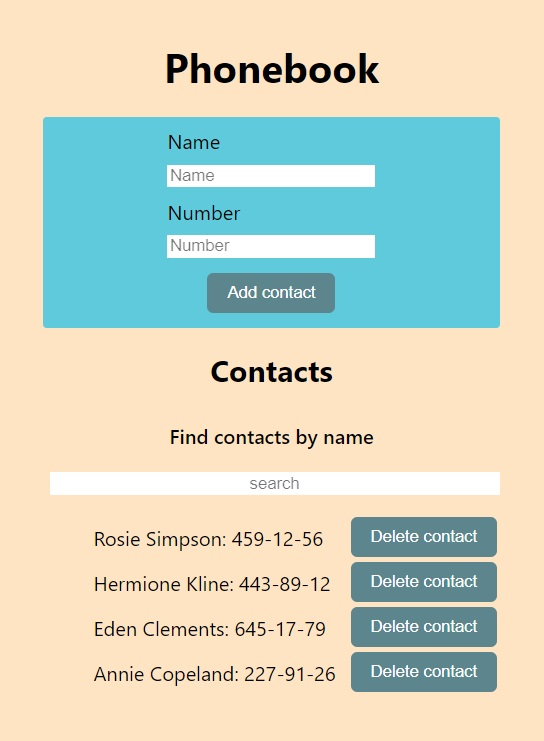
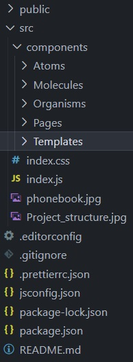

# Phonebook app

---

A simple app to store your phone book contacts.

## Introduction

---

The application consists of a form and a contact list. It is used to store phone
contacts, search for contacts and, if necessary, delete them.

## Technologies

---

- HTML
- CSS
- Java Script
- React.js

## Starting up

---

### First install all required dependencies:

- npm install

### To run the application, use the following command:

- npm start

### The application will run on localhost:3000.

## Project Structure

---

## Author

---

- Karolina Kaczorowska
- e-mail: kaczorowska.karolina@gmail.com
- GitHub: https://github.com/KaczorowskaKarolina
- LinkedIn: https://www.linkedin.com/in/karolina-kaczorowska-33b337220/
