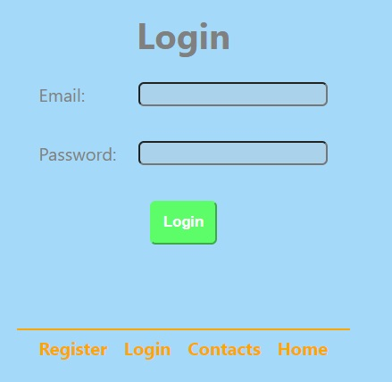

# Phonebook app

---

A simple app to store your phone book contacts.

## Introduction

---

The application has the ability to register a new user and save his contacts.
Once the user is already registered, can log in to edit contacts. User can add,
remove and filter contacts.

 

## Technologies

---

- HTML
- CSS
- Java Script
- React.js / Redux

## Starting up

---

### First install all required dependencies:

- npm install

### To run the application, use the following command:

- npm start

### The application will run on localhost:3000.

## Project Structure

---

## Author

---

- Karolina Kaczorowska
- e-mail: kaczorowska.karolina@gmail.com
- GitHub: https://github.com/KaczorowskaKarolina
- LinkedIn: https://www.linkedin.com/in/karolina-kaczorowska-33b337220/
